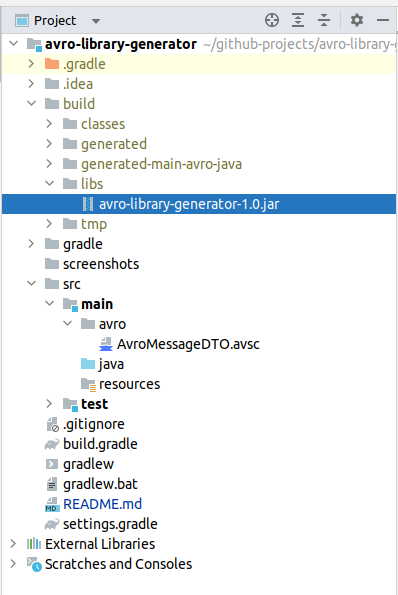

AVRO LIBRARY GENERATOR
-----------------------------------------------------------------

Application that generates a Jar file from an Avro schema.

The JAR file generated will be used by consumers/producers 
to serialize/deserialize Avro messages from Kafka.

-----------------------------------------------------------------

An Avro schema was generated in this project:

https://github.com/edgar-code-repository/avro-schema-generator

``` 
    {
      "type" : "record",
      "name" : "AvroMessageDTO",
      "namespace" : "com.domain.example.dto",
      "fields" : [
        { "name" : "code", "type" : "int" },
        { "name" : "message",  "type" : "string" },
        { "name" : "description",  "type" : "string" }
      ]
    }     
```

-----------------------------------------------------------------

In order to generate the Jar a plugin and 
a dependency are needed in the build.gradle file.

Plugins:

```
id "com.commercehub.gradle.plugin.avro" version "0.9.0"
```

Dependencies:
```
compile "org.apache.avro:avro:1.8.2"
```

The plugin searches for Avro schemas in folders named "avro" in
every source set.

In this case the schema file is located in the directory src/main/avro.

-----------------------------------------------------------------

When the build gradle task is executed, the Jar file 
appears in the build/libs directory:




-----------------------------------------------------------------